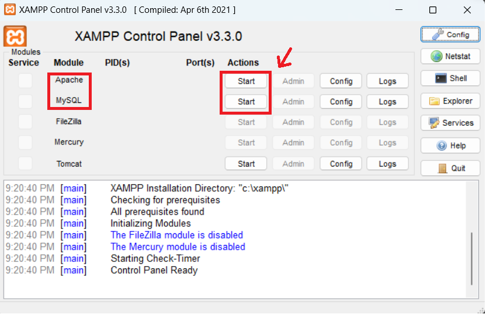

# Trang Web Chuyển Đổi PDF Sang DOCX Sử Dụng Java Servlet

## Giới Thiệu Đề Tài

Đề tài này tạo ra một trang web giúp người dùng chuyển đổi file PDF sang định dạng DOCX. Hệ thống được xây dựng trên nền tảng Java Servlet, với cấu trúc gồm 2 server hoạt động song song:

1. **Server 1 - Giao Diện Người Dùng (UI Server)**: Xử lý giao diện người dùng, tiếp nhận file PDF và trả về kết quả là file DOCX. Server này sử dụng mô hình **MVC** (Model-View-Controller) để quản lý luồng công việc.
   
2. **Server 2 - Server Xử Lý Dữ Liệu (Processing Server)**: Chịu trách nhiệm chuyển đổi file PDF sang DOCX. Khi nhận yêu cầu từ Server 1, Server 2 sẽ thực hiện chuyển đổi và gửi kết quả trả lại.

---

## Thiết Kế Hệ Thống


---

## Hướng Dẫn Cài Đặt

Để triển khai hệ thống, bạn cần làm theo các bước cài đặt sau:

### 1. Cài Đặt JDK

Đầu tiên, bạn cần cài **JDK** (Java Development Kit) để phát triển ứng dụng Java:

1. Truy cập [Oracle JDK Downloads](https://www.oracle.com/java/technologies/javase-downloads.html).
2. Tải và cài đặt phiên bản JDK phù hợp với hệ điều hành của bạn.

### 2. Cài Đặt Eclipse IDE

Sử dụng **Eclipse IDE** để phát triển ứng dụng Java Servlet:

1. Truy cập [Eclipse Downloads](https://www.eclipse.org/).
2. Tải và cài đặt phiên bản phù hợp với hệ điều hành của bạn.

**Lưu ý**: Sử dụng phiên bản Eclipse yêu cầu trong tài liệu.


### 3. Cài Đặt XAMPP

Cài đặt **XAMPP** để chạy Apache server và quản lý cơ sở dữ liệu MySQL:

1. Truy cập [XAMPP Downloads](https://www.apachefriends.org/).
2. Làm theo hướng dẫn cài đặt.

### 4. Mở Xampp Controller Panel:




### 5. Clone Dự Án

Clone mã nguồn từ GitHub về máy:

```
git clone https://github.com/BoPDA1607/PdfToDocx
```

**Hướng dẫn chi tiết**: [Video hướng dẫn](https://youtu.be/AJlqkaTask8)

### 6. Chạy Server xử lý


Chúc bạn thành công khi triển khai hệ thống!
---
